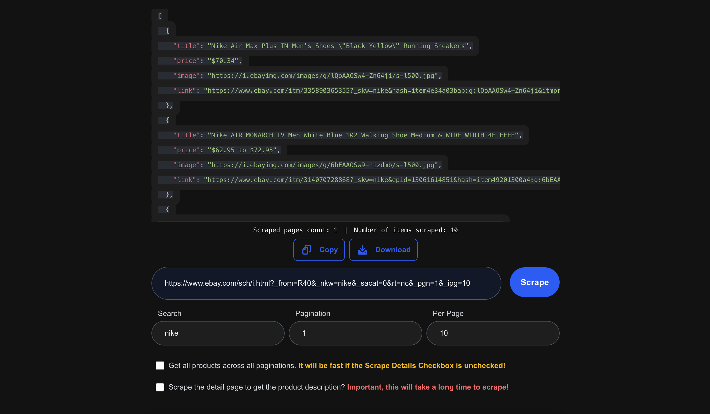

# eBay Scraping (Frontend)



## Description

**This is an eBay scraper that allows you to search for products and view the results in json.**

The backend streams results as they are scraped using Server-Sent Events (SSE), so the frontend receives data immediately without waiting for the entire scraping job to finish.

This real-time streaming improves user experience by showing results faster and letting users interact with partial data while more results continue loading.

You can find the backend here: [GitHub - ebay-scraping-backend](https://github.com/adiwahyudi02/ebay-scraping-backend)

## Tech Stack

- Next.js
- Styling (TailwindCSS + clsx)
- Form Handling (react-hook-form + zod validation)
- Json Viewer (react-syntax-highlighter + react-window for the virtualization performance)
- Typescript + eslint + husky

## Run the app

You can run locally with Node.js, or use Docker.

### Option 1: Local development

##### 1. Install Dependencies

```bash
  npm install
```

##### 2. Setup environments

Create a .env.local file in the root project by copying from the provided example file:

```bash
  cp .env.example .env.local
```

Then adjust the values to match your local setup.

##### 3. Run the app

```bash
  # run in dev mode
  npm run dev

  # or build & start production build
  npm run build
  npm run start
```

### Option 2: With Docker

This project includes a `docker-compose.yml` that runs the `ebayebay-scraping-backend` image and the `ebay-scraping-frontend` image together.

Docker images are published automatically to GitHub Container Registry (GHCR) through the CI/CD pipeline.

> By default, in `docker-compose.yml` uses the `latest` tag for the images. Optionally you can change it by checking the available tags in the GitHub Packages registry.

##### 1. Setup configuration in `docker-compose.yml`

Then adjust the values to match your local setup. especially for `OPENROUTER_API_KEY` environment. You can create your `OPENROUTER_API_KEY` by signing up and generating an API key at OpenRouter's official site: https://openrouter.ai/signup

##### 2. Docker scripts

- To start the Apps (Backend & Frontend)

```bash
   docker compose up

   # After that you can access the app in http://localhost:3000
```

- To stop and remove the containers:

```bash
   docker compose down
```

## Run Linter

```bash
  npm run lint
```
